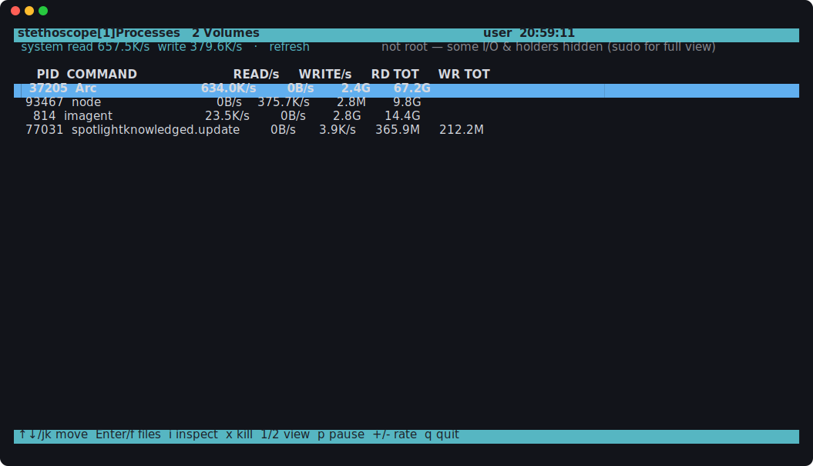

# stethoscope

**Vital signs for your Mac** — a machine's sense of its own internal state.

See exactly which process is hammering your disk, stalling on I/O, or refusing to let a drive eject — with more vitals (CPU, memory, battery, drive health) on the roadmap.



## Install

Homebrew (recommended):

```sh
brew install sauravvarma/tap/stethoscope
```

Or clone and run — there's nothing to build:

```sh
git clone https://github.com/sauravvarma/stethoscope.git
cd stethoscope && ./stethoscope disk top
```

Requirements: macOS. Everything it touches — `libproc`, `fs_usage`, `lsof`, system Python 3 — ships with the OS. No third-party dependencies.

## Quick start

```sh
sudo ./stethoscope disk top                     # who is doing disk I/O right now
sudo ./stethoscope disk inspect 12345           # why — live syscall trace of one pid
./stethoscope disk holds 12345                  # what files a process holds open
sudo ./stethoscope disk busy "/Volumes/X9 Pro"  # which pids won't let it eject
sudo -E ./stethoscope disk tui                  # full-screen interactive view
```

## The `disk` scope

Four questions, broad → narrow:

| Command | Question | sudo? |
|---|---|---|
| `disk top` | **Who** is doing disk I/O right now? | recommended¹ |
| `disk inspect <pid>` | **Why** — what paths, reads vs writes, is it blocking? | required |
| `disk holds <pid>` | **What** files is a process holding open? | for other users' processes |
| `disk busy <volume>` | **Which** pids are pinning a disk? ("why won't it eject") | recommended¹ |

`disk busy` accepts a mount path (`/Volumes/X9 Pro`), a volume name (`X9 Pro`), a device node (`disk6s2`), or a whole disk (`disk6` → all its slices), and tells you *why* each holder is pinning the volume — plus the `diskutil` escape hatch to force-eject.

### A note on sudo

One rule explains every ¹ above: **the kernel only shows a process's accounting to root or its owner.** Without sudo you see your own processes but not other users' or system daemons — and the daemons are frequently the answer (`mds`/Spotlight and `fseventsd` love holding external volumes). `inspect` is stricter: `fs_usage` refuses to trace at all without root. The TUI additionally wants `sudo -E` because plain `sudo` strips `$TERM`, which curses needs (the tool falls back to `xterm-256color` if it's missing).

### The TUI

`disk tui` is a full-screen view over the same data layer — two tabs (Processes, Volumes), popups for drill-down, and actions:

| Keys | Where | Action |
|---|---|---|
| `↑`/`↓` or `j`/`k` | everywhere | move selection |
| `1` / `2` / `Tab` | everywhere | switch tab |
| `p` / `space` | everywhere | pause sampling |
| `+` / `-` | everywhere | refresh rate |
| `Enter` / `f` | Processes | held-files popup |
| `i` | Processes | inspect — live `fs_usage` trace |
| `x` | Processes | kill process |
| `Enter` / `r` | Volumes | who's holding this volume |
| `e` | Volumes | eject |
| `q` | everywhere | quit |

Destructive actions (`x` kill, `e` eject) always ask for confirmation first.

## Scopes & roadmap

Each subsystem is a **scope** — a command namespace backed by a reusable data layer. `disk` is the first organ stethoscope knows how to examine:

| Scope | Status | What it examines |
|---|---|---|
| `disk` | **shipped** | per-process disk I/O, blocked syscalls, open-file holds, eject blockers |
| `cpu` + `memory` | [v0.2](https://github.com/sauravvarma/stethoscope/milestone/1) | who's pegging cores, wakeups, footprint, leak candidates |
| `battery` | [v0.3](https://github.com/sauravvarma/stethoscope/milestone/2) | per-process energy impact — what's draining you |
| `smart` | [v0.4](https://github.com/sauravvarma/stethoscope/milestone/3) | SMART data, drive wear, external-drive life expectancy |

On top of the scopes: [agent primitives](https://github.com/sauravvarma/stethoscope/milestone/4) (`--json` everywhere, one-shot sampling, a documented schema), [recording & baselines](https://github.com/sauravvarma/stethoscope/milestone/5) (what does *normal* look like on this machine), [anomaly detection](https://github.com/sauravvarma/stethoscope/milestone/6) (flag what deviates — leaks, runaway processes, `triage`), and [the doctor](https://github.com/sauravvarma/stethoscope/milestone/7) (`checkup`, MCP server, Homebrew core).

### For AI agents

stethoscope's probes are designed to become **primitives an agent can reason over**, not just screens a human watches. The intended loop: an agent notices a symptom ("battery draining fast", "disk constantly busy"), calls the relevant probes, gets structured vitals back (`--json`), correlates across scopes — *this process has a rising memory slope **and** a wakeup storm* — checks the machine's own recorded baseline, and proposes a diagnosis with the exact drill-down command to confirm it. The data layer already returns structures rather than text; [v0.5](https://github.com/sauravvarma/stethoscope/milestone/4) makes that contract public and stable, and [v1.0](https://github.com/sauravvarma/stethoscope/milestone/7) exposes it as MCP tools.

## How it works

*Background — skippable if you just want to use the tool. This explains how macOS exposes disk I/O and why the disk scope is built the way it is.*

A process doesn't touch the disk directly. It issues a **syscall** (`read`/`write`/`pread`/`fsync`…), which enters the **VFS** layer, usually hits the **unified buffer cache** (so most "reads" and "writes" never reach the device), and only on a cache miss or flush does the kernel enqueue a **block I/O request** to the storage driver, which the device completes asynchronously. Attributing physical disk activity back to a process means catching it at one of these layers. macOS gives three practical vantage points:

**1. `proc_pid_rusage()` — the spine of `top`.**
The kernel keeps a running tally per process: `ri_diskio_bytesread` and `ri_diskio_byteswritten` — cumulative bytes that were *charged to that process* as real device I/O. This is the exact number Activity Monitor's "Bytes Read/Written" column shows. We poll it across every pid (via `proc_listpids`) and diff between samples to get bytes/sec. It needs no tracing framework, survives **SIP**, and is cheap.

**2. `fs_usage` — the "why" behind `inspect`.**
Apple's supported syscall tracer. For one pid it streams every filesystem operation with the **path**, **byte count**, **elapsed time**, and — critically — a **`W`** marker when the call *blocked* (the thread was scheduled off-CPU waiting on I/O). That `W` is your "process is stalled on I/O" signal.

**3. `lsof` — the "what's held" behind `holds` and `busy`.**
Every file a process has open is an entry in its file-descriptor table. `lsof` enumerates them; `disk holds` keeps the regular files and directories — the actual on-disk objects the process is keeping open.

The reverse direction — *given a volume, which pids are pinning it* — is the "why won't this eject" problem. Passing a **mount point** to `lsof` makes it list every open file on that filesystem, and the FD column tells you the *reason* for each hold:

| FD column | Meaning |
|---|---|
| `cwd` | a process's working directory is on the volume (a very common silent blocker) |
| `txt` / `mem` | executing from / `mmap`-ed a file on the volume |
| `3r` `4w` `5u` | an open file descriptor (read / write / read-write) |
| `rtd` | the volume is a process's root directory |

`fuser -c <mount>` gives the same pids as a bare list; `busy` is the annotated version. Run it under sudo — otherwise system daemons like `mds` (Spotlight) and `fseventsd`, which frequently hold external volumes, stay invisible.

### Why not DTrace / `iosnoop` / `iotop`?

They give the richest block-layer view (per-request latency, device queue) on paper, but with **SIP enabled** (the default on modern macOS) DTrace's `io` provider is unreliable and often blocked. It's not a dependable spine, so this tool doesn't build on it. If you disable SIP you can add block-level tracing on top of the same questions.

## Limitations

**Buffered-write attribution.** `ri_diskio_byteswritten` charges a process for I/O it is *accountable* for. Because of the unified buffer cache, application `write()`s are buffered and the *physical* flush to the SSD is frequently performed later by kernel flush threads — so a burst of `dd`/app writes may show up delayed, spread out, or attributed to a system process rather than the originating one. This is a property of macOS's I/O accounting (Activity Monitor behaves identically), not a bug in the tool. **Cache-missing reads** and **sustained real workloads** (databases, indexing, backups, builds) attribute cleanly, which is the common case you actually want to catch. For exact byte-for-byte causation on a specific process, use `inspect` (`fs_usage`), which traces the syscalls themselves.

## Architecture

```
stethoscope          the dispatcher — `stethoscope <scope> <command>`
scopes/
  disk.py            disk scope: data layer + CLI commands (self-documenting header)
  disk_tui.py        disk scope: curses TUI over the same data layer
```

**The design rule:** each scope is one module exposing a **data layer** — pure functions returning structures — with thin **presentation** on top. The CLI and the TUI render the *same* functions; agent-facing output (`--json`) and anomaly detection will build on the data layer, never on rendered text. Fix a number in one place, every surface updates.

The TUI re-implements nothing:

| TUI surface | Backed by |
|---|---|
| Processes tab | `snapshot_diskio` + `rank_io` |
| Volumes tab → holders popup | `_mount_table` + `resolve_volume` + `collect_holders` |
| held-files popup | `open_files` |
| inspect drill-down | `cmd_inspect` (suspends curses, streams `fs_usage`) |

## License

[MIT](LICENSE).
